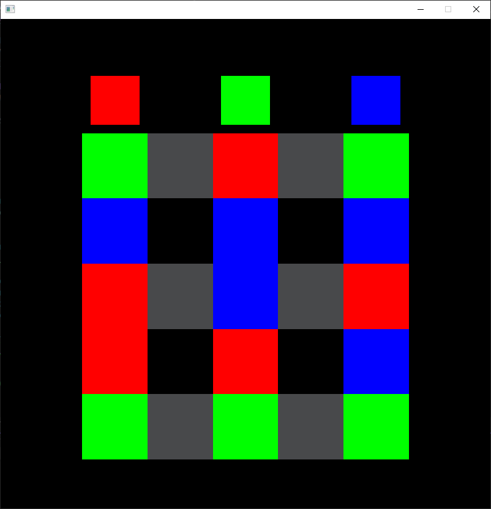

## Головоломка (WGA)



### Описание
На поле представлены квадраты красного, зеленого и синего цветов. Необходимо собрать три вертикальные линии соответствующих цветов путем перемещения квадратов как в пятнашках.
Серые квадраты - заблокированные ячейки.

### Управление
Перетаскивание квадратов в пустые ячейки осуществляется мышью (нужно перетаскивать цветные квадраты на пустые ячейки)

### Сборка
Сборка осуществляется при помощи CMAKE
```
mkdir cmake-build
cd cmake-build
cmake ..
make
```
После выполнения этих команд в папке build будет находиться собранная игра
